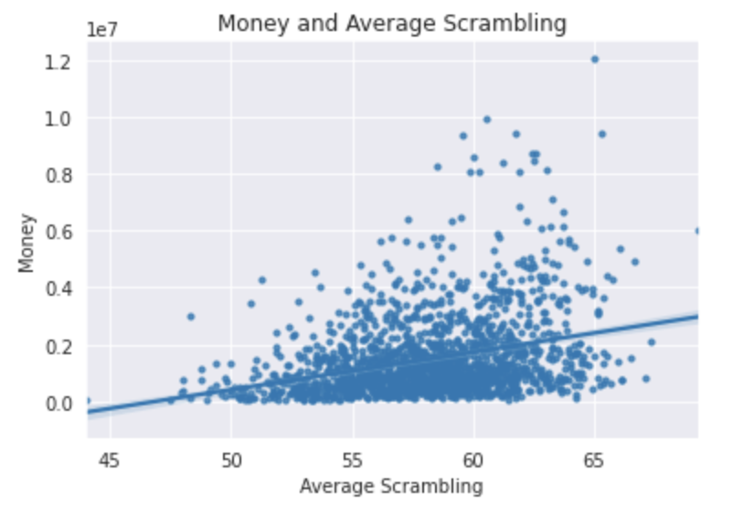
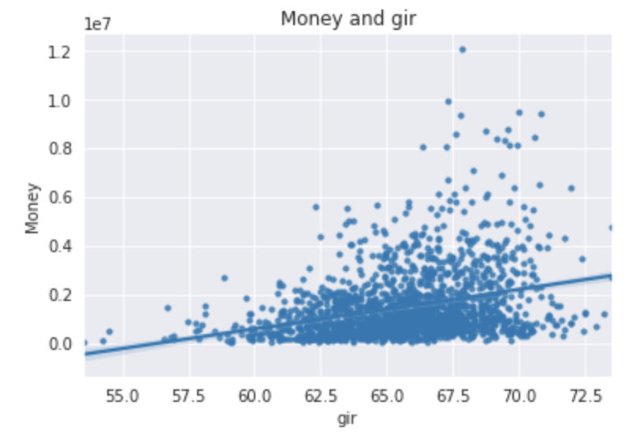
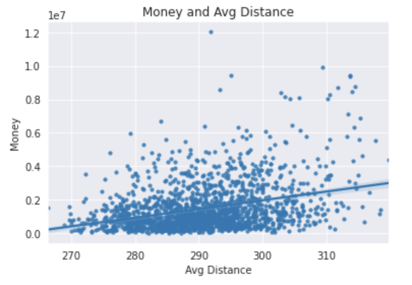
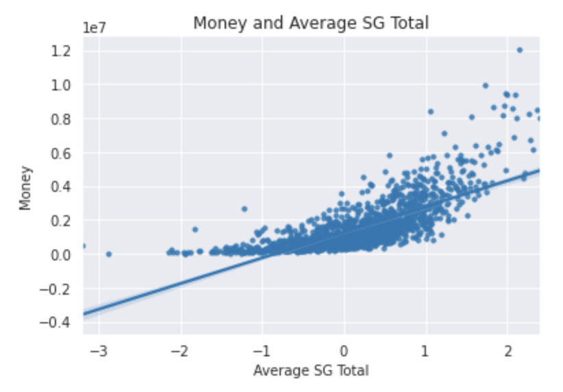
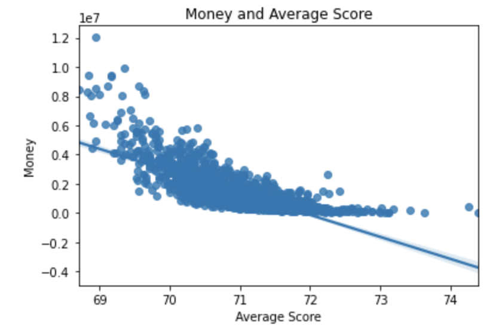
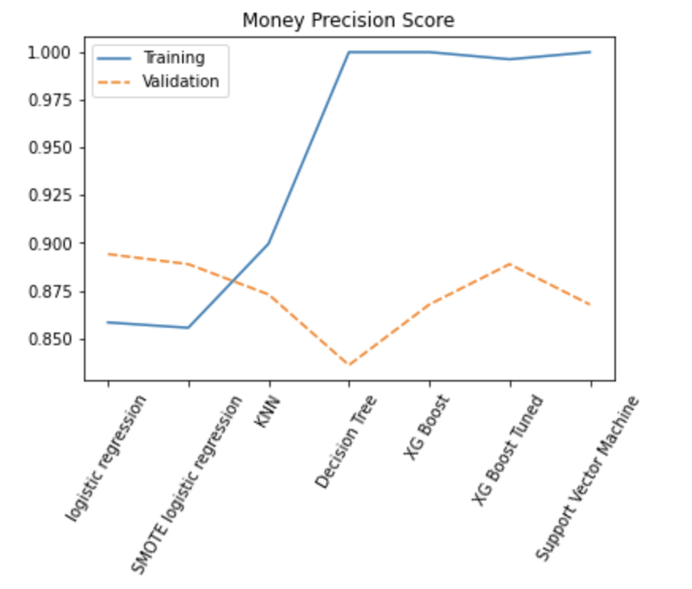

# Phase Three Project Repo
### Authors: Gabriel Warner, Charlie Fountain, Will Toranto

## Overview:
### Predictive model of PGA tour players performance to determine if they should be considered for a sponsorship or not to maximize the companies profit. 

## Business Problem:
### Callaway wants to expand their sponsorship program to become even more known.  They would like to sponsor players who have been improving and are likely to be in the spotlight in the coming years.

## Data:
### The pgaTourData from Kaggle was used for our analysis.  This data set contains 18 columns and 526 unique players from 2010-2018.  We removed rows with missing data and filtered the money column to only include players who have made over $500000.  After this, we had 438 unique players.

## Comparisions:
### We examined the correlation between different targets such as Money, Wins, and sponsorship with the features.  This helped us answer questions such as how much a player should get paid based on how they play, if a player will win a tournament, and if a player should receive a scholarship or not.

## Results:

### As average scrambling increses money also increses.
#
#

### As gir increses Money also increses.
#
#

### There is a moderate positive correlation between money and avg distance.
#
#

### There is a strong correlation between Money and avg SG total 
#
#

### As average score increses Money decreses.

### For our predictive money model, multiple machine learning models were used.  The graph shows that the logistic regression model had the best training and validation scores and the least difference.

### As the average score increases, money decreases.

#### For our money model, multiple machine learning models were used.  The graph shows that the logistic regression model had the best training and validation scores and the least difference.

# Conclusion:
#### Players that showed improvement over the eight years based on score and performance should be considered for a sponsorship: the amount paid increases, and performance increases.  
